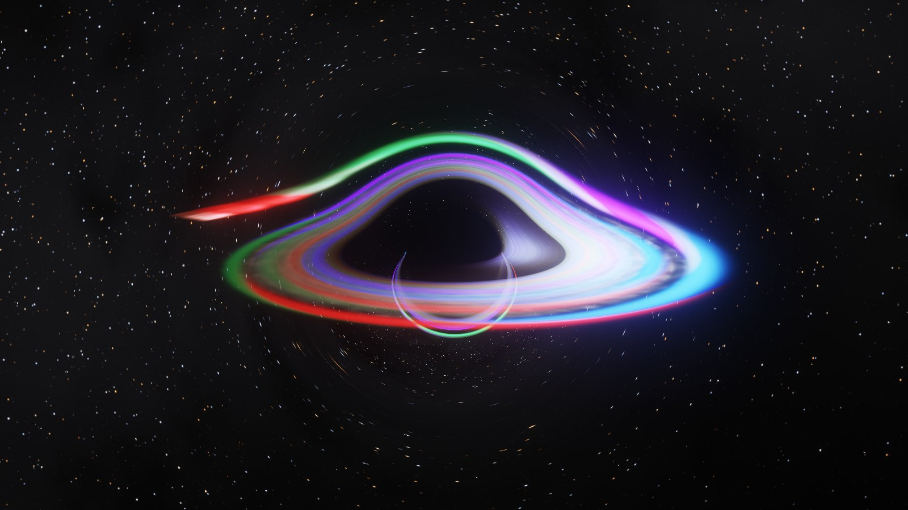
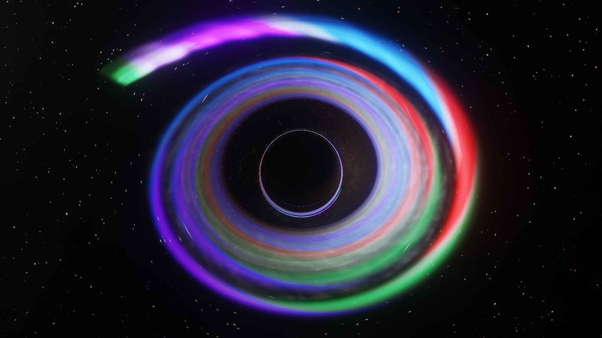
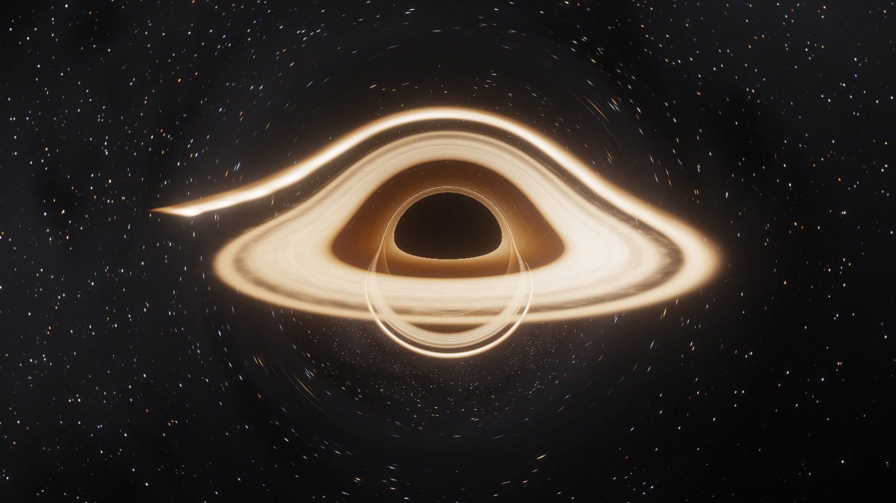
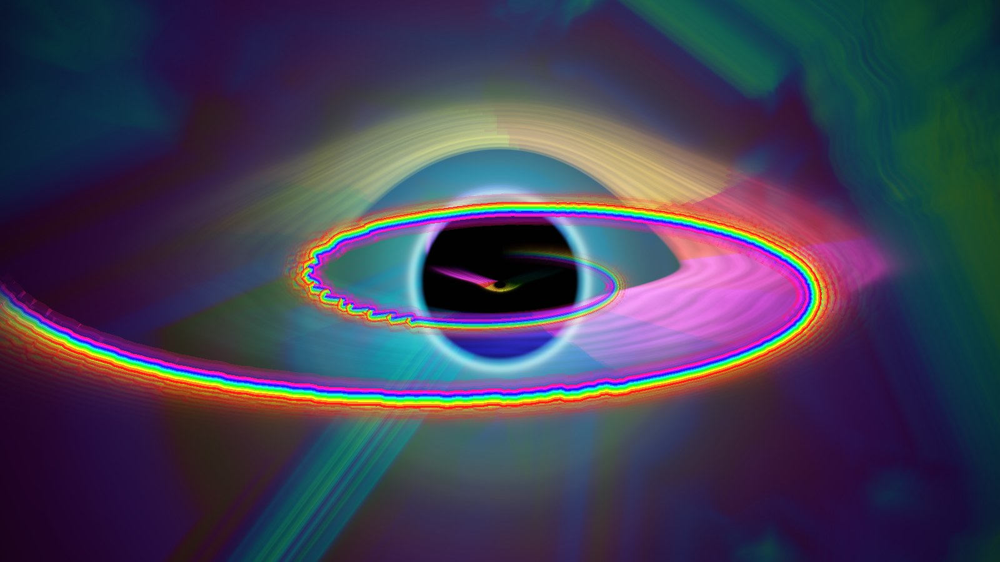

# Accretion

Music visualizers built around a black hole, running in the browser with WebGL 2. No build step and no dependencies.

**Try it live:**
- **[Accretion](https://pcriged.github.io/accretion/Realistic/)**, the realistic black hole
- **[Event Horizon](https://pcriged.github.io/accretion/)**, the original psychedelic version

Press **Demo groove** for built-in music, or load a track, use your microphone, or capture system audio.



## Accretion (`Realistic/`)

A physically based black hole that feeds on your music.

- **Gravitational lensing**: every pixel traces a light ray through Schwarzschild spacetime, giving the Einstein ring, the photon ring, and the far side of the disc arching over the shadow.
- **Accretion disc**: blackbody colour with a Novikov–Thorne temperature profile, relativistic Doppler beaming and gravitational redshift, rendered in HDR with bloom and ACES tone mapping.
- **Music as fuel**: the live spectrum is injected as a stream of gas (bass on the inside edge, treble outside) that spirals in and is sheared into the disc. Stream width follows loudness, colour follows the detected chord root, and beats cause flares.
- **Speaker pump**: gravity, and with it the lensing, thumps outward on every kick.

| Chord colours wound into the disc | Cinematic preset |
| --- | --- |
|  |  |

Drag to orbit, scroll to zoom. Keys: Space play/pause, H hide panel, F fullscreen.

## Event Horizon (root folder)

The original, stylised and psychedelic version.



## Running locally

Serve the folder over HTTP, then open `http://localhost:8765/` (Event Horizon) or `http://localhost:8765/Realistic/` (Accretion):

```bash
python -m http.server 8765
```

System audio capture works in Chrome and Edge: tick "Share system audio" in the picker. Microphone and system audio need HTTPS or localhost.

## License

[MIT](LICENSE)
